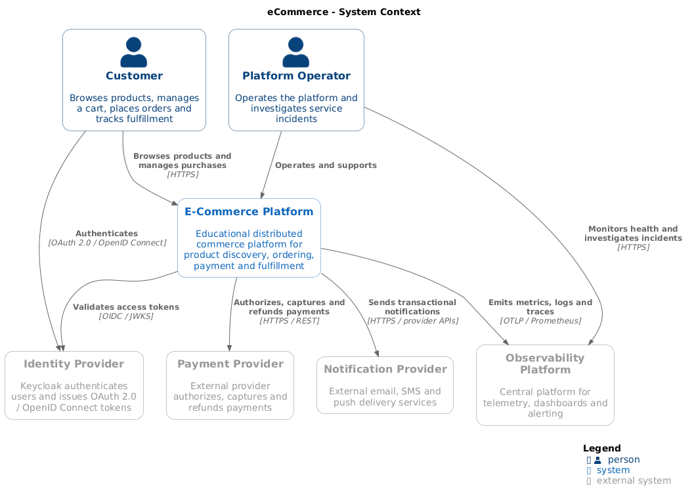

# Distributed version of the eCommerce platform

This platform is intentionally designed for educational purposes and does not claim to be a production-ready system. It
helps novice developers understand microservices, their interactions, and key patterns. Although the platform is
designed for educational purposes, it covers key topics in microservices development—such as asynchronous communication,
retries, rate limiters, and database persistence—as well as authentication and role-based authorization using a separate
external Identity Provider based on the OAuth 2.0 and OpenID Connect protocols.

## Project Architecture

The diagrams describe the target architecture. Repetitive relationships, such as identical database and telemetry
connections from every service, are summarized where necessary to keep the diagrams readable.

### Context Diagram

> You can find the rest of the documentation [here](https://github.com/thisdudkin/ecommerce-platform/tree/main/docs).
